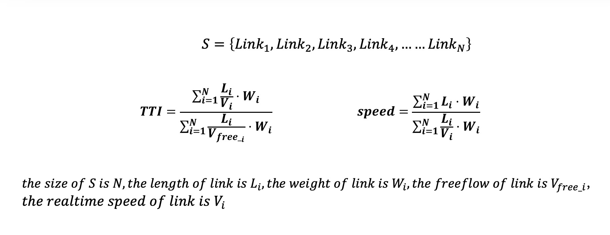

# TTI ,Smart Transportation Industry Standard! 

# 
[](https://github.com/didi/VirtualAPK/blob/master/LICENSE)
[](https://github.com/didi/VirtualAPK/releases)
[](https://github.com/didi/VirtualAPK/pulls)

The TTI (Travel Time Index) industry's most used evaluation index of urban 
congestion degree is the ratio of the actual travel time and the free flow time.
The larger the value, the worse the traffic operation status, and the congestion 
level is generally positive. Related, other abnormal weather conditions (such as rain, snow, fog, etc.)
or abnormal road conditions may also affect the value of TTI.


# Calculation method of traffic index

# Data curves of Beijing and Urumqi


# Required data

| Feature | Detail |
|:-------------|:-------------:|
| Road network data | Basic map road network data, including road shape and unique id |
| Realtime Traffic data | Relying on dripping massive floating car data, real-time traffic data released by Didi |
| Free flow data | From the Drip Trajectory database, the road speed generated by the excavation |
| weight data | The total number of vehicles passing the road within a natural month |

# Getting started

## GAIA Open Dataset
With DiDi's advantages in big data and technology, the GAIA Initiative provides academic community with real-life application use cases, anonymized data and computing resources, and seeks collaboration with the academic community. The Initiative aims to advance fundamental and prospective studies in transportation research. It promotes the application of scientific achievements by strengthening ties between industry, university and research. This effort will drive scientific development in intelligent transportation systems and contribute to societal development.With DiDi's advantages in big data and technology, the GAIA Initiative provides academic community with real-life application use cases, anonymized data and computing resources, and seeks collaboration with the academic community. The Initiative aims to advance fundamental and prospective studies in transportation research. It promotes the application of scientific achievements by strengthening ties between industry, university and research. This effort will drive scientific development in intelligent transportation systems and contribute to societal development.

Add a realtime traffic data API in `config.conf` in root of host project as following.

``` c++
dependencies {
    realtime_traffic_data 'http://sts.didichuxing.com/api/realtime?citycode=1&token=your token'
    roadnet 'http://sts.didichuxing.com/api/roadnet?citycode=1&token=your token'
    freeflow 'http://sts.didichuxing.com/api/freeflow?link_id=10001&token=your token'
    weight 'http://sts.didichuxing.com/api/weight?link_id=10001&token=your token'
}
```
In addition, you need to configure redis、mysql

# Compile c++ program
g++ -o TrafficIndex CommonTools.cpp LogUlits.cpp main.cpp md5.cpp TrafficIndex.cpp traffic_pb.pb.cc -lmysqlclient -lpq -I/usr/include/mysql -L/usr/lib64/mysql -I/usr/include -L/usr/lib64 -I/usr/local/protobuf/include -L/usr/local/protobuf/lib -I/usr/local/include/hiredis -L/usr/local/lib -I/usr/local/postgresql-9.6.6/include -L/usr/local/postgresql-9.6.6/lib -I/usr/local/leveldb -luuid -luuid -lpthread -lprotobuf -lhiredis -lcurl -lleveldb

Finally, Get executable program TrafficIndex

Start the calculation program like this
nohup ./TrafficIndex &


## Plugin Project

# Known issues

* Only supports the data format of DIDI, other data types are not supported.
* Need to apply for open data from DIDI.

# Contributing

Welcome to contribute by creating issues or sending pull requests. See [Contributing Guide](CONTRIBUTING.md) for guidelines.

# Who is using TTI?

 

# License

TTI is licensed under the Apache License 2.0. See the [LICENSE](LICENSE) file.
