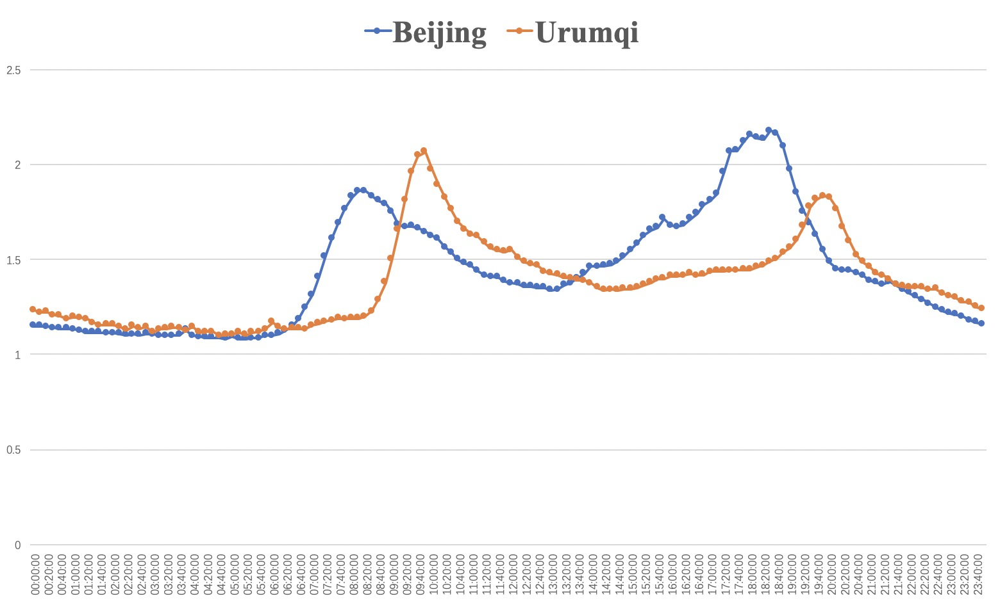

# TTI ,Smart Transportation Industry Standard! 

# 
[](https://github.com/didi/VirtualAPK/blob/master/LICENSE)
[](https://github.com/didi/VirtualAPK/releases)
[](https://github.com/didi/VirtualAPK/pulls)

The TTI (Travel Time Index) industry's most used evaluation index of urban 
congestion degree is the ratio of the actual travel time and the free flow time.
The larger the value, the worse the traffic operation status, and the congestion 
level is generally positive. Related, other abnormal weather conditions (such as rain, snow, fog, etc.)
or abnormal road conditions may also affect the value of TTI.

Free flow refers to the speed of travel that a motor vehicle can achieve at low traffic and low density. In the actual calculation, the average of the fastest cumulative 4-hour sample speed in one month is used as the free flow of the road segment.

The cumulative number of vehicles passing through the road segment was observed as the weight value within one month.

Required data：
1:Road network data
2:Realtime Traffic data
3:Historical traffic data


Custom TTI analysis allows users to use the DD's massive traffic information database of Drips to calculate TTI, velocity, standard deviation and other data to analyze the travel characteristics of an area. It is possible to calculate TTI data for any time period and any range since November 2016.

Analyze the speed of the road segment to determine the bottleneck causing congestion and its impact
Analyze traffic times before and after road network changes to assess impact or improvement
Detect seasonality, the impact of events and events on traffic congestion or density
Measure the accessibility of a route or area annually
Identify and prioritize bottlenecks that cause congestion in an area

# Calculation method of traffic index




# Required data

| Feature | Detail |
|:-------------|:-------------:|
| Road network data | Basic map road network data, including road shape and unique id |
| Realtime Traffic data | Relying on dripping massive floating car data, real-time traffic data released by Didi |
| Free flow data | From the Drip Trajectory database, the road speed generated by the excavation |
| weight data | The total number of vehicles passing the road within a natural month |

# Getting started

## Host Project

Add a dependency in `build.gradle` in root of host project as following.

``` java
dependencies {
    classpath 'com.didi.virtualapk:gradle:0.9.8.6'
}
```

Apply plugin in application module of `build.gradle`.

```
apply plugin: 'com.didi.virtualapk.host'
```

Compile VirtualAPK in application module of `build.gradle`.

``` java
compile 'com.didi.virtualapk:core:0.9.8'
```

Initialize `PluginManager` in `YourApplication::attachBaseContext()`.

``` java
@Override
protected void attachBaseContext(Context base) {
    super.attachBaseContext(base);
    PluginManager.getInstance(base).init();
}
```

Modify proguard rules to keep VirtualAPK related files.

```
-keep class com.didi.virtualapk.internal.VAInstrumentation { *; }
-keep class com.didi.virtualapk.internal.PluginContentResolver { *; }

-dontwarn com.didi.virtualapk.**
-dontwarn android.**
-keep class android.** { *; }
```

Finally, load an APK and have fun!

``` java
String pluginPath = Environment.getExternalStorageDirectory().getAbsolutePath().concat("/Test.apk");
File plugin = new File(pluginPath);
PluginManager.getInstance(base).loadPlugin(plugin);

// Given "com.didi.virtualapk.demo" is the package name of plugin APK, 
// and there is an activity called `MainActivity`.
Intent intent = new Intent();
intent.setClassName("com.didi.virtualapk.demo", "com.didi.virtualapk.demo.MainActivity");
startActivity(intent);
```

## Plugin Project

Add a dependency in `build.gradle` in root of plugin project as following.

``` java
dependencies {
    classpath 'com.didi.virtualapk:gradle:0.9.8.6'
}
```

Apply plugin in application module of `build.gradle`.

```
apply plugin: 'com.didi.virtualapk.plugin'
```

Config VirtualAPK. Remember to put following lines at the end of `build.gradle`.

```
virtualApk {
    packageId = 0x6f             // The package id of Resources.
    targetHost='source/host/app' // The path of application module in host project.
    applyHostMapping = true      // [Optional] Default value is true. 
}
```

# Developer guide

* API document [wiki](https://github.com/didi/VirtualAPK/wiki)
* Sample project [PluginDemo](https://github.com/didi/VirtualAPK/tree/master/PluginDemo)
* Read [core library source code](https://github.com/didi/VirtualAPK/tree/master/CoreLibrary)
* Read [Release notes](RELEASE-NOTES.md)

# Known issues

* Notifications with custom layout are not supported in plugin.
* Transition animations with animation resources are not supported in plugin.

# Contributing

Welcome to contribute by creating issues or sending pull requests. See [Contributing Guide](CONTRIBUTING.md) for guidelines.

# Who is using VirtualAPK?

 

# License

VirtualAPK is licensed under the Apache License 2.0. See the [LICENSE](LICENSE) file.
